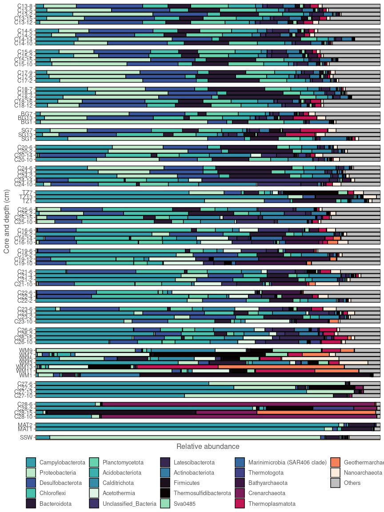

Barplots
================
Sven Le Moine Bauer
2022-11-24

## Introduction

Here is the script to produce the barplots. I describe only the barplot
at the phylum level, but the principle is same for other taxonomic
levels. All what you have to do is to agglomerate OTUs at another level.
Also, if you want only some seafloor types like in supplementary
material 7, you can subset the phyloseq object with the samples desired.

## Loading the data

Load the libraries and set the working directory

``` r
library(ggplot2)
library(plyr)
library(dplyr)
library(viridis)
library(scales)
library(phyloseq)
library(ggthemr)

# Set directory
setwd(dirname(rstudioapi::getActiveDocumentContext()$path))
```

Load the data.

``` r
OTUtable <- read.csv("otutab_decontam.csv", row.names=1, sep = "\t")
taxtable <- read.csv("tax_decontam.csv", row.names = 1, sep = ",")
Metatable <- read.csv("Metadata.csv", row.names = 1, sep = ",")
```

In barplots we look at percentages, so let’s convert the OTU table first
and then make a phyloseq object.

``` r
# Get percentage data.
OTU_perc <- prop.table(as.matrix(OTUtable), margin = 2)*100

# Trasnform into matrices
OTUtable <- as.matrix(OTU_perc)
taxtable <- as.matrix(taxtable)

#Make phyloseq object
OTU = otu_table(OTUtable, taxa_are_rows = TRUE)
TAX = tax_table(taxtable)
samples = sample_data(Metatable)
Milos <- phyloseq(OTU, TAX, samples)

# Remove undesired samples.
to_remove <- c("TZF", "WMF", "C25_0", "C26_0", "blank")
Milos <- prune_samples(!(sample_names(Milos) %in% to_remove), Milos)
```

## Barplot at the phylum level.

The first thing to do is to agglomerate the taxa at the phylum level.

``` r
Milos_phylum <- tax_glom(Milos, taxrank = "Phylum")
```

Then we want to select only the relatively most abundant taxa to plot,
otherwise it would be impossible to see anything on the figure. Here I
decide (after looking into the data) to group together all phyla that
are not making 10% of the community in any sample.

``` r
# To do this we get out of phyloseq
phylum_distribution <- psmelt(Milos_phylum) #Make a dataframe out of the phyloseq object.
phylum_distribution$Phylum <- as.character(phylum_distribution$Phylum) # Make sure the taxa are strings

# Look for the max abundance of each phylum among all samples
phylum_max <- ddply(phylum_distribution, ~Phylum, function(x) c(max=max(x$Abundance))) 

# Get a list of the taxa that are not making 10% in at least one sample.
phylum_others <- phylum_max[phylum_max$max < 10,]$Phylum
# Getting OTU names
phylum_others_OTU <- row.names(tax_table(Milos_phylum))[apply(tax_table(Milos_phylum), 1, function(u) any(u %in% phylum_others))]
# And then merging these taxa in the phyloseq object
Milos_phylum <- merge_taxa(Milos_phylum, phylum_others_OTU)# Back to phyloseq, merge the OTUs listed before.
tax_table(Milos_phylum)[,c(1:2)]
```

    ## Taxonomy Table:     [23 taxa by 2 taxonomic ranks]:
    ##         Domain     Phylum                         
    ## OTU_1   "Archaea"  "Geothermarchaeota"            
    ## OTU_3   "Bacteria" "Campylobacterota"             
    ## OTU_4   "Archaea"  "Crenarchaeota"                
    ## OTU_11  "Bacteria" "Bacteroidota"                 
    ## OTU_13  "Bacteria" "Thermosulfidibacterota"       
    ## OTU_16  "Archaea"  "Thermoplasmatota"             
    ## OTU_20  "Bacteria" "Proteobacteria"               
    ## OTU_25  "Bacteria" "Acetothermia"                 
    ## OTU_26  "Bacteria" "Desulfobacterota"             
    ## OTU_30  "Bacteria" "Firmicutes"                   
    ## OTU_32  "Archaea"  "Bathyarchaeota"               
    ## OTU_33  "Bacteria" "Sva0485"                      
    ## OTU_35  "Bacteria" "Calditrichota"                
    ## OTU_39  "Bacteria" "Acidobacteriota"              
    ## OTU_46  "Bacteria" "Chloroflexi"                  
    ## OTU_53  "Archaea"  "Nanoarchaeota"                
    ## OTU_60  "Bacteria" "Unclassified_Bacteria"        
    ## OTU_72  "Bacteria" "Latescibacterota"             
    ## OTU_84  "Bacteria" "Planctomycetota"              
    ## OTU_133 NA         NA                             
    ## OTU_166 "Bacteria" "Marinimicrobia (SAR406 clade)"
    ## OTU_192 "Bacteria" "Thermotogota"                 
    ## OTU_316 "Bacteria" "Actinobacteriota"

This is still a lot of phyla, but it is difficult to reduce more with so
many heterogeneous samples. Now we can polish the data for the plot.

``` r
# Get out of phyloseq again to plot the data.
phylum_distribution <- psmelt(Milos_phylum) 
phylum_distribution$Phylum <- as.character(phylum_distribution$Phylum)

#Give the name "others" to the phylum of the grouped OTUs.
phylum_distribution$Phylum[is.na(phylum_distribution$Phylum)] <- "Others" 

#I want to have an organised order of taxa, with Archaea first, the Bacteria, and Other last, and everything ranked by abundance within each category.
phylum_total <- (ddply(phylum_distribution, ~Phylum, function(x) c(sum=sum(x$Abundance))))
phylum_total <- phylum_total[order(phylum_total$sum),]
order_barplot <- phylum_total$Phylum
order_barplot
```

    ##  [1] "Thermotogota"                  "Marinimicrobia (SAR406 clade)"
    ##  [3] "Sva0485"                       "Nanoarchaeota"                
    ##  [5] "Geothermarchaeota"             "Thermosulfidibacterota"       
    ##  [7] "Firmicutes"                    "Thermoplasmatota"             
    ##  [9] "Bathyarchaeota"                "Actinobacteriota"             
    ## [11] "Crenarchaeota"                 "Latescibacterota"             
    ## [13] "Unclassified_Bacteria"         "Acetothermia"                 
    ## [15] "Calditrichota"                 "Acidobacteriota"              
    ## [17] "Planctomycetota"               "Bacteroidota"                 
    ## [19] "Chloroflexi"                   "Desulfobacterota"             
    ## [21] "Others"                        "Proteobacteria"               
    ## [23] "Campylobacterota"

``` r
order_barplot <- c(order_barplot[21],  order_barplot[c(4,5,8,11,9)], order_barplot[-c(5,4,8,11,9,21)])

# I also want to keep the Core and depth order.
phylum_distribution <- phylum_distribution[order(phylum_distribution$Core, as.numeric(phylum_distribution$Depth)),]
phylum_distribution$Sample <- factor(phylum_distribution$Sample, levels = rev(unique(phylum_distribution$Sample)))
phylum_distribution$Phylum <- factor(phylum_distribution$Phylum, levels = order_barplot)
phylum_distribution$Core = factor(phylum_distribution$Core, levels=c("C13", "C14", "C15", "C17", "C18","BG", "SG", "C20", "C24", "TZ","C25", "C16","C19","C21","C22","C23", "C26", "WM", "C27","C28","MAT", "SSW"))

# I also wanted to replace the underscore by a dash as it looks better.
phylum_distribution$Sample <- gsub('_', '-', phylum_distribution$Sample)

#The colors for the taxa.
colors <- c(sample(mako(17)[]), rocket(20)[c(4,7,10,15,20)], "grey")
```

And finally the plot!

``` r
ggthemr("fresh")
ggplot(phylum_distribution, aes(x = Sample,
                                y = Abundance, 
                                fill = Phylum)) +
  geom_bar(stat="identity", colour = "black") +
  scale_y_discrete(expand = c(0,0)) +
  scale_fill_manual(values = colors, breaks = rev(order_barplot)) +
  theme(legend.position = "bottom",
        legend.title = element_blank(),
        strip.text.y = element_blank()) +
  coord_flip() +
  labs(x = "Core and depth (cm)", y = "Relative abundance") +
  facet_grid(Core~., space = "free", scales = "free")
```

<!-- -->
