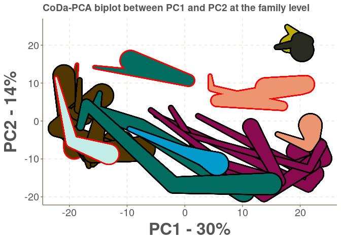
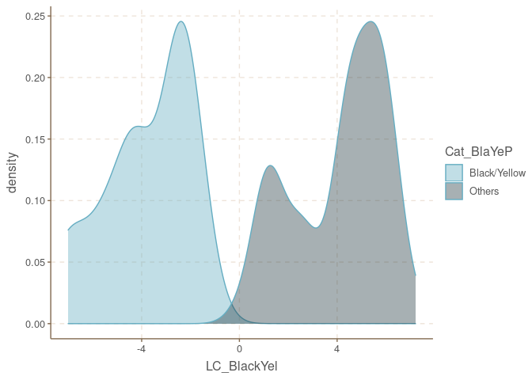
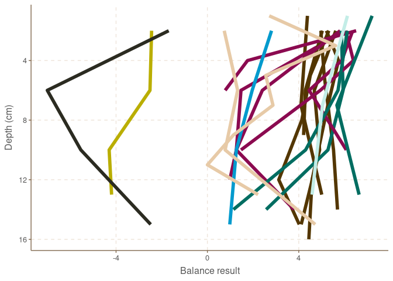

The CoDA analysis
================
Sven Le Moine Bauer
2022-11-22

## Introduction

In this part of the analysis we will go through the code used in the
analysis of the microbial compositions:

-   The CoDA-PCA biplots.
-   The balances.

At this point it is expected that the data has been run through the
decontamination pipeline. The files to be imported can be found on the
Github.

## Loading and preparing the data.

Let’s start by loading the libraries and set up the working directory

``` r
library(ggrepel)
library(selbal)
library(plyr)
library(ggthemr)
library(ggplot2)
library(ggforce)
library(phyloseq)
library(ggtext)

# Set directory
setwd(dirname(rstudioapi::getActiveDocumentContext()$path))
```

The two following functions are also needed (mBiplext and geom_link3).

``` r
############Function GEOM_LINK3 ###############
# This is a modified version of geom_link2, see https://stackoverflow.com/questions/66187022/how-to-add-edges-borders-to-geom-link2-follow-up-question
GeomPathInterpolate3 <- ggproto(
  "GeomPathInterpolate3",
  ggforce:::GeomPathInterpolate,
  default_aes = aes(colour = "black",
                    size = 0.5,
                    linetype = 1,
                    alpha = NA,
                    border_colour = "black",
                    border_width = 0),
  draw_panel = environment(Geom$draw_panel)$f,
  draw_group = function (data, panel_scales, coord, arrow = NULL, 
                         lineend = "butt", linejoin = "round", linemitre = 1, 
                         na.rm = FALSE)   {
    if (!anyDuplicated(data$group)) {
      message("geom_path_interpolate: Each group consists of only one observation. ", 
              "Do you need to adjust the group aesthetic?")
    }
    data <- data[order(data$group), , drop = FALSE]
    data <- interpolateDataFrame(data)
    munched <- coord_munch(coord, data, panel_scales)
    rows <- stats::ave(seq_len(nrow(munched)), 
                       munched$group, FUN = length)
    munched <- munched[rows >= 2, ]
    if (nrow(munched) < 2) {
      return(zeroGrob())
    }
    attr <- ggplot2:::dapply(data, "group", function(df) {
      ggplot2:::new_data_frame(list(solid = identical(unique(df$linetype), 1), 
                                    constant = nrow(unique(df[, 
                                                              c("alpha", "colour", 
                                                                "size", "linetype",
                                                                "border_width")])) == 1))
    })
    solid_lines <- all(attr$solid)
    constant <- all(attr$constant)
    if (!solid_lines && !constant) {
      stop("geom_path_interpolate: If you are using dotted or dashed lines", 
           ", colour, size and linetype must be constant over the line", 
           call. = FALSE)
    }
    n <- nrow(munched)
    group_diff <- munched$group[-1] != munched$group[-n]
    start <- c(TRUE, group_diff)
    end <- c(group_diff, TRUE)
    if (!constant) {
      ggplot2:::ggname("geom_link_border",
                       grid::grobTree(grid::segmentsGrob(munched$x[!end], munched$y[!end], munched$x[!start],
                                                         munched$y[!start], default.units = "native", arrow = arrow,
                                                         gp = grid::gpar(col = munched$border_colour[!end],
                                                                         fill = munched$border_colour[!end],
                                                                         lwd = munched$border_width[!end] * .pt,
                                                                         lty = munched$linetype[!end],
                                                                         lineend = lineend, linejoin = linejoin, linemitre = linemitre)),
                                      grid::segmentsGrob(munched$x[!end], munched$y[!end], munched$x[!start],
                                                         munched$y[!start], default.units = "native", arrow = arrow,
                                                         gp = grid::gpar(col = alpha(munched$colour, munched$alpha)[!end],
                                                                         fill = alpha(munched$colour, munched$alpha)[!end],
                                                                         lwd = munched$size[!end] * .pt,
                                                                         lty = munched$linetype[!end],
                                                                         lineend = lineend, linejoin = linejoin, linemitre = linemitre))))
    }
    else {
      ggplot2:::ggname("geom_link_border",
                       grid::grobTree(grid::polylineGrob(munched$x, munched$y, default.units = "native", 
                                                         arrow = arrow, 
                                                         gp = grid::gpar(col = munched$border_colour[!end],
                                                                         fill = munched$border_colour[!end], 
                                                                         lwd = munched$border_width[start] * .pt, 
                                                                         lty = munched$linetype[start], lineend = lineend, 
                                                                         linejoin = linejoin, linemitre = linemitre)),
                                      grid::polylineGrob(munched$x, munched$y, default.units = "native", 
                                                         arrow = arrow, 
                                                         gp = grid::gpar(col = alpha(munched$colour, munched$alpha)[start],
                                                                         fill = alpha(munched$colour, munched$alpha)[start], 
                                                                         lwd = munched$size[start] * .pt, 
                                                                         lty = munched$linetype[start], lineend = lineend, 
                                                                         linejoin = linejoin, linemitre = linemitre))))
      
    }
  }
)

geom_link3 <- function (mapping = NULL, data = NULL, stat = "link2", 
                        position = "identity", arrow = NULL, lineend = "butt", 
                        na.rm = FALSE, show.legend = NA, inherit.aes = TRUE, n = 100, 
                        ...) {
  layer(data = data, mapping = mapping, stat = stat, geom = GeomPathInterpolate3, 
        position = position, show.legend = show.legend, inherit.aes = inherit.aes, 
        params = list(arrow = arrow, lineend = lineend, na.rm = na.rm, 
                      n = n, ...))
}


######## FUNCTION mBiplext ####################
# Compositional biplot, colored by population,
# with additional real variables incorporated.
# Programmed by J.J. Egozcue (2020) based on
# previous function mBPPOP (Dec. 2014)
##### draws a CoDa-biplot with data coming from
# populations coded by a number xpop indicating
# color from a color sequence in colist.
# carries out clr of data set.
# centres the clr and the additional real variables
# in extr. Then they are added to the centered clr.
# carries out svd of centred clr and added real
# extra variables in extr
# plots biplot with data colored by xpop (number of color)
##### input:
# x compositional data by rows (matrix)
# xpop factor indicating the population of each row in x
# extr a vector or a matrix of real variables to be added
#    to the biplot.
# namextr name of a variable (only for single variable added)
# biscale    = 1 covariance biplot
#            = 0 form biplot
# circ       = FALSE (default) ; TRUE plots a unit circle
#              in form biplots
# punch      = 0 do not plot data points
#            = 1 plot symbols for data points
#              following pchpoint
#            = 2 plot numbers for data points following
#              pchpoints
#            = 3 lines between consecutive data points
#              are drawn
# choice[1:2] = PC's to be plotted, eg c(1,2), c(1,3)...
# colist a color sequence for populations.
# pchpoint integer sequence determining the plot pch symbol
#     of each point; when punch=2 is the number to be plotted.
# optpdf = 1  prints on pdf
# filename (optional) defines the name of the output pdf file.
#         by default formBPPOP.pdf or covBPPOP.pdf are used
#### output: a list containing
# the svd matrices: U, V, and singular values in D
# explained variance in the biplot explvar
# additionally
# a pdf file containing the biplot is printed in working dir.
###################################################

mBiplext <- function(x,xpop=NULL,extr=NULL,choice=c(1,2),
                     biscale=1,punch=1,colist=1:10,
                     circ=FALSE,colcirc="grey70",
                     optpdf=0,filename=NULL,
                     namextr=c("tot"),
                     colray="red",colextr="darkgreen",
                     cextext=1,lwdray=1,pchpoint=1){
  # point colors
  colpoint = rep(1,length(colist))
  if(!is.null(xpop)){
    colpoint = colist
  }
  # clr of x
  logx=log(x)
  xclr = logx - outer(rowMeans(logx),rep(1,length=ncol(logx)))
  # centring xclr
  cxclr = xclr - outer(rep(1,nrow(xclr)), colMeans(xclr))  
  # centering real variables extr, if any
  extrue=FALSE
  nextr=NULL
  if(!is.null(extr)){
    if(is.vector(extr)){
      cextr = extr - mean(extr)
      mextr = matrix(cextr,nrow=length(extr),ncol=1)
      colnames(mextr)=namextr
      nextr=1
      extrue = TRUE
    }
    if(is.matrix(extr)){
      namextr = colnames(extr)
      mextr = extr-outer(rep(1,nrow(extr)),colMeans(extr))
      nextr=ncol(mextr) }
    # append real variables in extr  
    cxclr1= cbind(cxclr,mextr)
    colnames(cxclr1)=c(colnames(xclr),namextr)
    cxclr=cxclr1
    extrue = TRUE
  }
  # svd (cxclr)
  SVDxclr = svd(cxclr)
  U = SVDxclr$u
  V = SVDxclr$v
  rownames(V)=colnames(cxclr)
  D = SVDxclr$d
  # scores and loadings
  ## covariance biplot
  if(biscale==1){
    ld=t(diag(D)%*%t(V))/sqrt(nrow(cxclr))
    mainT="covariance biplot"
    fileT="covBiplext"
    mld=max(abs(ld[,choice]))
    msc=max(abs(U[,choice]))
    sc=U *(mld/msc)  # scaling scores
    xylimit=c(-mld,mld)
  }
  
  ## form biplot
  ## scaling: unit norm of V-vectors
  if(biscale==0){
    sc=U%*%diag(D)
    ld=V
    mainT="form biplot"
    fileT="formBiplext"
    mld = max(abs(ld[,choice]))     # scaling basis vectors
    msc = max(abs(sc[,choice]))
    sc = sc*(mld/msc)
    xylimit = c(-mld,mld)
  }
  
  # numeric output
  variances = D^2
  totvar=sum(variances)/(nrow(x)-1)
  extrvar=0
  if(extrue==TRUE){
    extrvar = var(extr) }
  explvar = (variances[choice[1]]+variances[choice[2]])/sum(variances)
  # names
  #  clrnames=paste("clr.",colnames(x),sep="")
  clrnames=colnames(cxclr)
  if(choice[1] == 1){
    expl=100*variances[choice[1]]/sum(variances)
    xlabel=paste("first axis,", " var% ",format(expl,nsmall=1,digits=3),sep="")}
  if(choice[1] == 2){
    expl=100*variances[choice[1]]/sum(variances)
    xlabel=paste("second axis,", " var% ",format(expl,nsmall=1,digits=3),sep="")}
  if(choice[1] == 3){
    expl=100*variances[choice[1]]/sum(variances)
    xlabel=paste("third axis,", " var% ",format(expl,nsmall=1,digits=3),sep="")}
  if(choice[1] >= 4){
    expl=100*variances[choice[1]]/sum(variances)
    xlabel=paste(paste(choice[1],"th axis",sep=""), " var% ",format(expl,nsmall=1,digits=3),sep="")}
  if(choice[2] == 1){
    expl=100*variances[choice[2]]/sum(variances)
    ylabel=paste("first axis,"," var% ",format(expl,nsmall=1,digits=3),sep="")}
  if(choice[2] == 2){
    expl=100*variances[choice[2]]/sum(variances)
    ylabel=paste("second axis,"," var% ",format(expl,nsmall=1,digits=3),sep="")}
  if(choice[2] == 3){
    expl=100*variances[choice[2]]/sum(variances)
    ylabel=paste("third axis,"," var% ",format(expl,nsmall=1,digits=3),sep="")}
  if(choice[2] >= 4){
    expl=100*variances[choice[2]]/sum(variances)
    ylabel=paste(paste(choice[2],"th axis",sep=""), " var% ",format(expl,nsmall=1,digits=3),sep="")}
  
  if(punch==0){pun="n"}
  if(punch==1){pun="p"}
  if(punch==2){pun="n"}
  if(punch==3){pun="b"}
  
  # pdf output
  filenam=paste(fileT,".pdf",sep="")
  if(optpdf==1){
    if(is.null(filename)==FALSE){filenam=filename}
    pdf(filenam, width=5, height=5, fam="Times")}
  
  plot(sc[,choice],col=colist,type=pun,cex=0.8,asp=1,
       xlim=xylimit,ylim=xylimit,main=mainT,
       xlab=xlabel,ylab=ylabel,pch=pchpoint)
  # only form biplot: unit circle on variables
  if(circ==TRUE & biscale==0){
    theta = seq(from=0, to=(2*pi),length=150)
    xc=cos(theta)
    yc=sin(theta)
    lines(xc,yc,col="grey70")
  }
  
  #  this is for changing punch in place of color
  #  plot(sc[,choice],col="black",type=pun,cex=0.8,asp=1,
  #       pch=colpoint,
  #       xlim=xylimit,ylim=xylimit,main=mainT,
  #       xlab=xlabel,ylab=ylabel)
  
  if(punch==2){
    #    text(sc[,choice],labels=(1:nrow(sc)),col=colpoint,cex=0.8)       
    text(sc[,choice],labels=pchpoint,col=colpoint,cex=0.8)
  }
  for(i in 1:ncol(x)){
    xx=rbind(c(0,0),ld[i,choice])
    lines(xx, col=colray,lwd=lwdray)
    xtext = ld[i,choice[1]]
    ytext = ld[i,choice[2]]
    text(xtext,ytext,labels=clrnames[i],col=colray,
         pos=2,offset=0.3,cex=cextext)
  }
  if(!is.null(nextr)){
    for(iex in 1:nextr){
      nnrow = ncol(x)+iex
      xxetr = rbind(c(0,0),ld[nnrow,choice])
      lines(xxetr,col=colextr,lwd=lwdray)
      xtextr = ld[nnrow,choice[1]]
      ytextr = ld[nnrow,choice[2]]
      text(xtextr,ytextr,labels=clrnames[nnrow],col=colextr,
           pos=2,offset=0.3,cex=cextext)
    } }
  
  if(optpdf==1){
    dev.off()
  }
  lout = list("U"=U,"V"=V,"D"=D,"explvar"=explvar,"totvar"=totvar,
              "extrvar"=extrvar)
  return(lout)
}
```

Now let’s load the data.

``` r
OTUtable <- read.csv("otutab_decontam.csv", row.names=1, sep = "\t")
taxtable <- read.csv("tax_decontam.csv", row.names = 1, sep = ",")
Metatable <- read.csv("Metadata.csv", row.names = 1, sep = ",")
```

Now we can make a phyloseq object.

``` r
#Transform into matrixes the OTU and tax tables (needed for phyloseq)
OTUtable <- as.matrix(OTUtable)
taxtable <- as.matrix(taxtable)

#Make phyloseq objects.
OTU = otu_table(OTUtable, taxa_are_rows = TRUE)
TAX = tax_table(taxtable)
samples = sample_data(Metatable)
Milos <- phyloseq(OTU, TAX, samples)
```

We first remove the samples that are not sediments, i.e. mats, seawater
and fluids samples.

``` r
to_remove <- c("MAT1", "MAT2", "SSW", "TZF", "WMF", "C25_0", "C26_0", "blank")
Milos <- prune_samples(!(sample_names(Milos) %in% to_remove), Milos)
```

Here I will only show how to do the analysis at the family level, but
the same approach can be used at other taxonomic level. So now I pool
OTUs into families.

``` r
Milos_family <- tax_glom(Milos, taxrank = "Family")
OTU_family <- as.data.frame(otu_table(Milos_family)) # Get out of phyloseq
mean(unlist(OTU_family) %in% "0") * 100 # Check how many 0s there are in our table.
```

    ## [1] 62.10278

Now we have only 676 taxa remaining, but still 62% of Os in our OTU
table. These need to be removed when working with log ratios, so we will
add 1 as a pseudocount to each count. As well, we will change the OTU
name by the family name.

``` r
OTU_family_noOs <- OTU_family + 1 
rownames(OTU_family_noOs) <- tax_table(Milos_family)[,5]
```

Now we are ready for further analysis.

## CoDA-PCA biplots

We use the mBiplext function. In short, it does a clr transformation,
then centers the data, and runs a singular value decomposition. Then we
will extract the scores and loadings for the form/covariance biplots,
and plot them.

``` r
PCjuanjo <- mBiplext(t(OTU_family_noOs), extr = NULL, biscale = 0)
```

Now we can check how much variance is explained by each PC.

``` r
(PCjuanjo$D)^2/sum((PCjuanjo$D)^2)
```

    ##  [1] 3.038506e-01 1.353682e-01 9.181730e-02 7.534993e-02 4.221128e-02
    ##  [6] 3.732333e-02 2.905987e-02 2.366188e-02 1.820031e-02 1.455492e-02
    ## [11] 1.361725e-02 1.331577e-02 1.019316e-02 9.557382e-03 8.871580e-03
    ## [16] 8.722446e-03 7.247223e-03 7.006035e-03 6.732906e-03 6.392422e-03
    ## [21] 5.850426e-03 5.783002e-03 5.551240e-03 5.125912e-03 4.955942e-03
    ## [26] 4.756991e-03 4.551700e-03 4.441003e-03 4.118763e-03 3.895413e-03
    ## [31] 3.796224e-03 3.649500e-03 3.644751e-03 3.525523e-03 3.362138e-03
    ## [36] 2.974449e-03 2.914861e-03 2.848755e-03 2.725071e-03 2.607757e-03
    ## [41] 2.579561e-03 2.521997e-03 2.365218e-03 2.323999e-03 2.123078e-03
    ## [46] 2.048552e-03 1.995843e-03 1.904021e-03 1.844215e-03 1.834740e-03
    ## [51] 1.816336e-03 1.743161e-03 1.682957e-03 1.631331e-03 1.581602e-03
    ## [56] 1.511159e-03 1.485467e-03 1.471343e-03 1.353216e-03 1.299925e-03
    ## [61] 1.274013e-03 1.232144e-03 1.216609e-03 1.150693e-03 1.130830e-03
    ## [66] 1.102177e-03 1.057885e-03 1.022432e-03 1.013329e-03 9.746797e-04
    ## [71] 9.483377e-04 9.143916e-04 8.632123e-04 8.445900e-04 7.810018e-04
    ## [76] 7.303390e-04 7.181690e-04 6.522291e-04 6.182784e-04 5.037598e-04
    ## [81] 5.992396e-32

Variance explained by the 3 first PCs: 30%, 14%, 9%.

Now we want to extract the scores for the form biplot. From the SVD,
they are the product of the U matrix and the singular values (diagonal
matrix d). Here I only extract the scores for the 3 first PCs.

``` r
PCA_scores <- as.data.frame(PCjuanjo$U%*%diag(PCjuanjo$D))[,1:3]
rownames(PCA_scores) <- rownames(sample_data(Milos_family)) # And give the good names to the rows.
```

Now we need to add some info to the dataframe that will be relevant in
the plot. We import these from the metadata file.

``` r
Metatable <- Metatable[!(row.names(Metatable) %in% c("MAT1", "MAT2", "SSW", "TZF", "WMF", "C25_0", "C26_0")),] # Subset the table
PCA_scores <- PCA_scores[order(match(rownames(PCA_scores), rownames(Metatable))),] # Reorder the rows
PCA_scores$CORE <- Metatable$Core[match(row.names(PCA_scores), row.names(Metatable))] # Add the CORE variable
PCA_scores$DEPTH <- Metatable$Depth[match(row.names(PCA_scores), row.names(Metatable))] # Add the DEPTH variable
PCA_scores$SEAFLOOR <- Metatable$Seafloor_type[match(row.names(PCA_scores), row.names(Metatable))] # Add the seafloor variable
PCA_scores$SEAFLOOR <- factor(PCA_scores$SEAFLOOR, levels= c("Background", "Seagrass", "Bioturbation", "Ochre patches", "White patches", "Mat patches", "Black patches", "Yellow patches")) # Factorise it, otherwise ggplot will mix up everything.
PCA_scores$BORDERS <- PCA_scores$DEPTH +2 # This is the size of the borders in geom_link3
PCA_scores$DATASET <- Metatable$Dataset[match(row.names(PCA_scores), row.names(Metatable))] # From which dataset the sample comes from
PCA_scores$DATASETcol <- with(PCA_scores, ifelse(DATASET == "Saganaki", 'red', 'black')) # Assign a color per dataset. It will be sued for the border of the links.
PCA_scores <- PCA_scores[order(PCA_scores$SEAFLOOR, PCA_scores$CORE, PCA_scores$DEPTH),] # Order everything by seafloor, then cores, then depth.

col <- c("#533600", "#C3EDE7", "#006D61", "deepskyblue3", "deeppink4", "lightsalmon2", "#2B2B21", "#BAAE00") # The palette
```

And plot!

``` r
ggthemr("fresh")
ggplot(PCA_scores, aes(x = V1, y = V2)) + 
  geom_link3(aes(group = CORE, colour = SEAFLOOR, size = DEPTH, border_width = BORDERS, border_colour = DATASETcol), lineend = 'round', n= 500) +
  scale_colour_manual(values = col) +
  scale_size_identity() +
  theme(
    axis.text.x = element_text(size = 15),
    legend.title = element_text(size = 20, face="bold"),
    legend.text = element_text(size = 15),
    axis.text.y = element_text(size = 15),
    legend.position = "none",
    panel.spacing.x = unit(1, "lines"),
    axis.title=element_text(size=25,face="bold")) +
  labs(x = "PC1 - 30%", y = "PC2 - 14%") +
  guides(color = guide_legend(override.aes = list(size = 5))) +
  ggtitle("CoDa-PCA biplot between PC1 and PC2 at the family level")
```

<!-- -->

And this is figure 2A, despite the weird proportions in the markdown
output. For supplementary material 5, one can change the variables
plotted to use V3 for the 3rd component for example. Also, one can
agglomerate the OTUs at other taxonomic levels at the beginning of the
process. Finally, let’s build the covariance biplot shown in figure 2B.
First we want to extract both the scores and the loadings. In a
covariance biplot, the scores are the matrix U, while the loadings are
the product of the matrix V and the singular values (diagonal matrix d)
transposed. Let’s start with the scores.

``` r
PCA_scores_cov <- as.data.frame(PCjuanjo$U[,1:3])
rownames(PCA_scores_cov) <- rownames(sample_data(Milos_family))
Metatable <- as.data.frame(sample_data(Milos_family))
PCA_scores_cov$SEAFLOOR <- Metatable$Seafloor_type # Add the seafloor type to the dataframe.
```

Now we want to take the center of the scores for each seafloor type. in
order to decluter the plot.

``` r
PCA_scores_cov <- aggregate(PCA_scores_cov[,1:3], list(PCA_scores_cov$SEAFLOOR), mean) # Calculate the centers
PCA_scores_cov$Group.1 <- factor(PCA_scores_cov$Group.1, levels= c("Background", "Seagrass", "Bioturbation", "Ochre patches", "White patches", "Mat patches", "Black patches", "Yellow patches")) # Factorise the order of Seafloors
col <- c("#533600", "#C3EDE7", "#006D61", "deepskyblue3", "deeppink4", "lightsalmon2", "#2B2B21", "#BAAE00") # The palette
```

Now let’s get the loadings in another dataframe, and select only the
taxa that were in the balances (see next chapter).

``` r
Loadings_cov <- as.data.frame(t((diag(PCjuanjo$D)%*%t(PCjuanjo$V))[1:3,]))
ListTaxaBalance <- c("Desulfatiglandaceae", "Unclassified_Woesearchaeales", "Desulfosarcinaceae",
                     "Unclassified_SPG12-343-353-B69", "Desulfobulbaceae", "Unclassified_Anaerolineae", 
                     "Marinifilaceae", "Unclassified_Incertae Sedis (Desulfobacterota)", "Korarchaeaceae",
                     "Oscillatoriaceae", "Unclassified_Dehalococcoidia", "Unclassified_Acetothermiia",
                     "Sulfurovaceae", "Desulfurococcaceae", "Unclassified_Caldisericales", 
                     "Unclassified_Bacillales")

Loadings_cov <- Loadings_cov[rownames(Loadings_cov) %in% ListTaxaBalance,]
```

And plot!

``` r
ggthemr("fresh")
ggplot(PCA_scores_cov, aes(x = V1*100, y = V2*100)) + 
  geom_segment(data = Loadings_cov, aes(x = 0, y = 0, xend = V1, yend = V2), colour = "red", size = 1, arrow = arrow(length = unit(0.2, "cm"))) +
  geom_label_repel(data=Loadings_cov, aes(x= V1, y= V2,  label = rownames(Loadings_cov)), size = 4) +
  geom_point(aes(fill = Group.1, colour = "black"), shape = 21, size =8, stroke = 2) +
  scale_fill_manual(values = col) +
  scale_colour_manual(values = "black") +
  theme(
    axis.text.x = element_text(size = 15),
    legend.title = element_text(size = 20, face="bold"),
    legend.text = element_text(size = 15),
    axis.text.y = element_text(size = 15),
    panel.spacing.x = unit(1, "lines"),
    axis.title=element_text(size=25,face="bold"),
    legend.position = "none") +
  labs(x = "PC1", y = "PC2")
```

<!-- -->

It looks a bit off in markdown, but you get the idea!

## Balances

Now we will make the balances. I will only show how to make the balance
between on one side the black and yellow seafloor types, and on the
other side all other seafloor types (Fig 5E). To compute the other
balances, one can simply use another ‘cat\_’ variable from the metadata
file. First we want to select only the most important taxa, relatively
speaking. Having too many taxa adds some noise and is also demanding for
the computer. Here, we select only the families that make at least 1% of
the composition in at least 1 sample. So let start by getting an OTU
table with relative abundance.

``` r
OTU_perc <- prop.table(otu_table(Milos_family), margin = 2)*100
OTU_perc <- otu_table(OTU_perc, taxa_are_rows = TRUE)
Milos_perc <- Milos_family
otu_table(Milos_perc) <- OTU_perc
```

Now we need to select the dominant taxa, for this we get out of
phyloseq.

``` r
family_distribution <- psmelt(Milos_perc) #Make a dataframe out of the phyloseq object.
family_distribution$Family <- as.character(family_distribution$Family) # Make sure everything is a string
family_max <- ddply(family_distribution, ~Family, function(x) c(max=max(x$Abundance))) #Look for the max abundance of each family among all samples
family_less1 <- family_max[family_max$max < 1,]$Family #List of the family that never do 1% in any sample, 510 taxa!
```

A small problem now is that afterwards we want to use the absolute
abundance data, and we have now a list of names from the relative
abundance table. Seems that R does not keep the same OTU name when
pooling. So we will now look at the matching OTUs in the Milos_family
taxa_names().

``` r
family_less1_OTU <- row.names(tax_table(Milos_family))[apply(tax_table(Milos_family), 1, function(u) any(u %in% family_less1))]
TaxaToKeep <- taxa_names(Milos_family)[!(taxa_names(Milos_family) %in% family_less1_OTU)] # list of taxa to keep in the count table
Milos_family1 = prune_taxa(TaxaToKeep, Milos_family) # Select the 166 taxa.
```

Now there is a bit of preparation to be able to use the data in selbal.

``` r
OTUtable <- as.data.frame(t(otu_table(Milos_family1))) # Get the OTU table, transposed
taxtable <- as.data.frame(tax_table(Milos_family1)) # Get the taxonomy table
Metatable <- as.data.frame(sample_data(Milos_family1)) # Get the metadata
colnames(OTUtable) <- taxtable$Family # Change the names of the taxa in the OTU table.
OTUtable_no0 <- OTUtable +1 # Add +1 to each count as we are working with logs and ratios.
Metatable$Seafloor_type <- factor(Metatable$Seafloor_type, levels = c("Background", "Seagrass", "Bioturbation", "Ochre patches","White patches", "Mat patches", "Black patches", "Yellow patches")) # Factorise the order of seafloor type.
col <- c("#533600", "#C3EDE7", "#006D61", "deepskyblue3","deeppink4", "#E7CAA7", "#2B2B21", "#BAAE00") # The palette
```

Now we are ready to run the selbal algorithm, using the grouping
presented in the ‘Cat_BlaYep’ variable of the Metadata.

``` r
selbal_BlaYeP <- selbal(x = OTUtable_no0, y = as.factor(Metatable$Cat_BlaYeP), maxV = 12, draw = FALSE)
selbal_BlaYeP$numerator # which taxa are in the numerator of the balance?
selbal_BlaYeP$denominator # which taxa are in the denominator of the balances?
Metatable$LC_BlackYel <- as.numeric(selbal_BlaYeP$balance.values) # Add the results to the Metadata table.
```

Selbal selects the balance Sulfurovaceae vs Desulfurococcaceae. Let’s
make a nice plot out of it. One can make a density plot.

``` r
ggplot(data=Metatable, aes(x=LC_BlackYel, group=Cat_BlaYeP, fill=Cat_BlaYeP)) +
  geom_density(adjust=0.8, alpha=.4)
```

<!-- -->

One can also plot the values against depth, as in figure 5.

``` r
ggthemr("fresh")
ggplot(Metatable, aes(x = Depth, y = LC_BlackYel, group = Core)) + 
  geom_line(aes(colour = Seafloor_type), size = 2) +
  scale_color_manual(values = col) +
  theme(legend.position="none") +
  labs(y = "Balance result", x= "Depth (cm)") +
  xlim(16,1) +
  coord_flip()
```

<!-- -->
