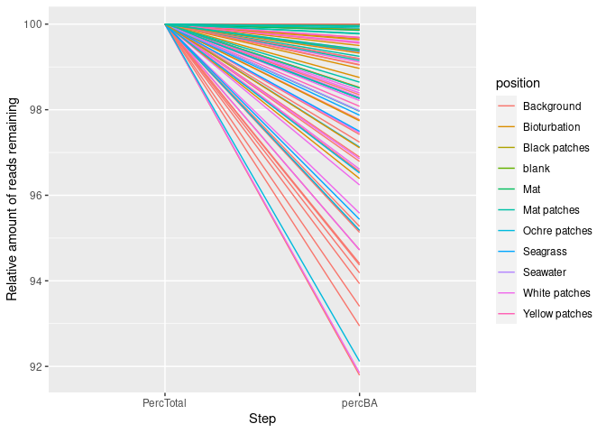
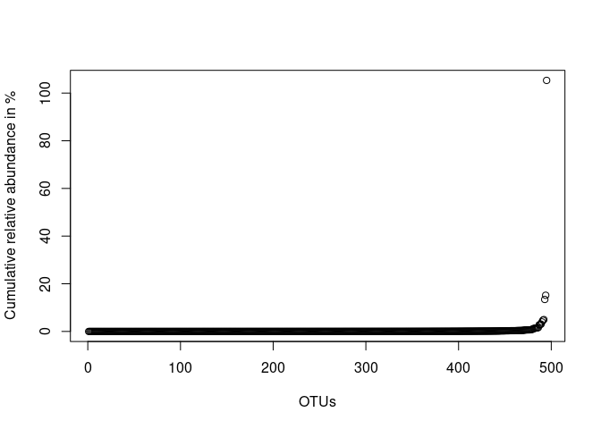
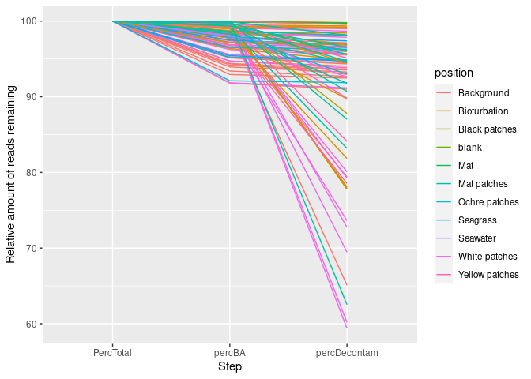
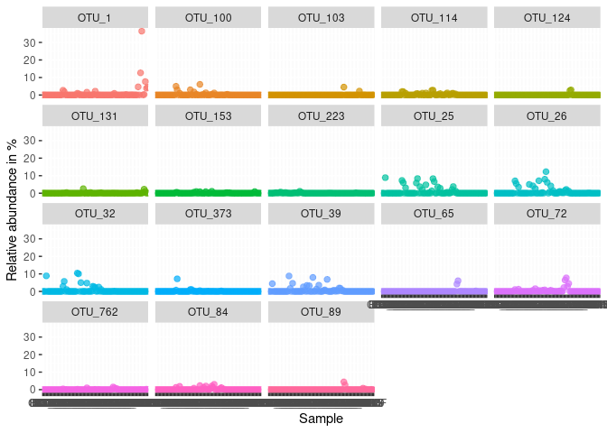
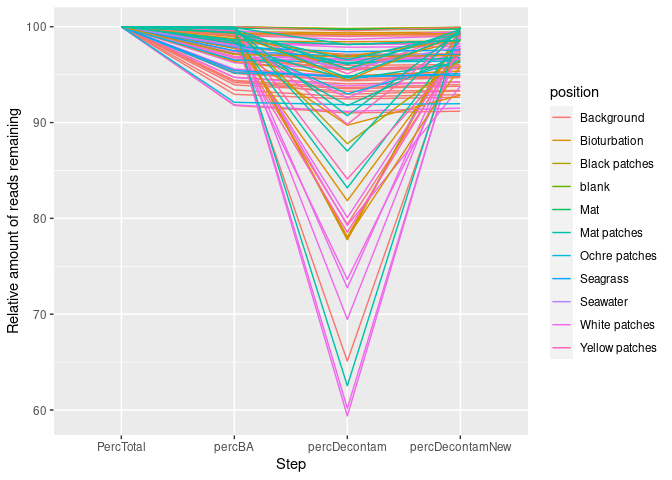
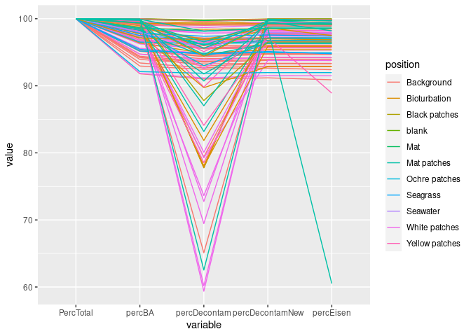
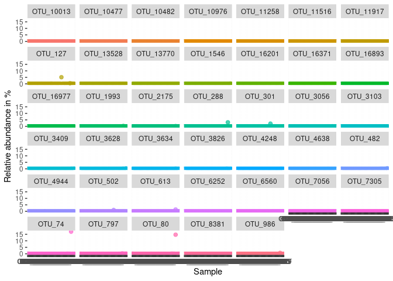
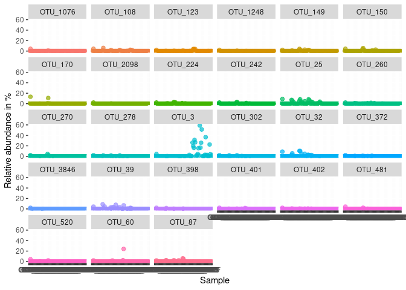
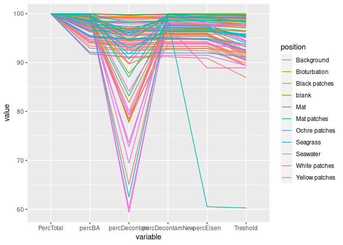

Decontamination pipeline
================
Sven Le Moine Bauer
2022-11-21

## Introduction

This is the pipeline used to identify and remove contaminants from our
dataset. The inputs are the files outputed after the CREST4 command in
the previous pipeline. However, note that in the tax file the leading
spaces before each taxa have been removed. As well, the supertaxa levels
have been removed to keep only Domain, phylum, class, order, family,
genus, species.

The pipeline goes through several steps of decontamination:

-   Removal of OTUs not assigned to Bacteria or Archaea.
-   The frequency approach from the decontam package.
-   Removal of a list of knoan contaminants.
-   Removal of OTUs present in the blank.
-   Removal of OTUs below a certain abundance threshold.

We however want to have a critic look at each step, to see how it
influences each sample. As such, we ended up modulating strongly the
original plan.

## Loading and preparing the data.

Let’s start by loading the libraries and set up the working directory

``` r
library(reshape2) # Used to transform tables
library(ggplot2) # Used to plot data
library(phyloseq) # Used to play around with OTU tables
library(decontam) # Decontamination package

# Set directory
setwd(dirname(rstudioapi::getActiveDocumentContext()$path)) # Sets the directory to the place the script is saved.
```

Now we can import the data. They should be in the same directory as the
script.

``` r
OTUtable <- read.csv("Otutab.sorted.tsv", row.names=1, sep = "\t")
Metatable <- read.csv("Metadata.csv", row.names = 1, sep = ",")
taxtable <- read.csv("assignments.txt", row.names = 1, sep = "\t")
```

The taxonomic output of CREST4 keeps empty cells when there is no
taxonomic assignemt. This may be problematic when pooling at higher
taxonomic levels as all the unassigned taxa may be pooled together
regardless of their higher taxonomy. Therefore we will replace all empty
cells with Unassigned_XXX. XXX being the last assigned level.

``` r
for (i in 1:nrow(taxtable)){taxtable[i,] <- as.character(taxtable[i,])}
for (i in 1:nrow(taxtable)){
  if (taxtable[i,2] == ""){
    phylum <- paste("Unclassified_", taxtable[i,1], sep = "")
    taxtable[i, 2:7] <- phylum
  } else if (taxtable[i,3] == ""){
    class <- paste("Unclassified_", taxtable[i,2], sep = "")
    taxtable[i, 3:7] <- class
  } else if (taxtable[i,4] == ""){
    order <- paste("Unclassified_", taxtable[i,3], sep = "")
    taxtable[i, 4:7] <- order
  } else if (taxtable[i,5] == ""){
    family <- paste("Unclassified_", taxtable[i,4], sep = "")
    taxtable[i, 5:7] <- family
  } else if (taxtable[i,6] == ""){
    genus <- paste("Unclassified_", taxtable[i,5], sep = "")
    taxtable[i, 6:7] <- genus
  } else if (taxtable[i,7] == ""){
    species <- paste("Unclassified_", taxtable[i,6], sep = "")
    taxtable[i, 7] <- species
  }
}
rm(i, class, family, genus, order, phylum, species) # Some cleanup
```

Time to make a phyloseq object, as well as a version of it with relative
abundances.

``` r
OTU = otu_table(as.matrix(OTUtable), taxa_are_rows = TRUE)
TAX = tax_table(as.matrix(taxtable))
samples = sample_data(Metatable)
Milos <- phyloseq(OTU, TAX, samples)
Milos_rel <- transform_sample_counts(Milos, function(x) x/sum(x)) # The version with relative abundance.
```

An I also create a table that will be filled over time with how many
reads remain for each samples after each decontamination step.

``` r
counts <- data.frame(sample_sums(Milos))
counts$Sample <- rownames(counts)
counts$position <- Metatable$Seafloor_type
counts$PercTotal <- 100
```

## Remove OTUs that are not Archaea or Bacteria

The strategy is to remove any taxa from the phyloseq object that are not
assigned to Archaea or Bacteria at the Domain level.

``` r
Milos_BA <- subset_taxa(Milos, Domain %in% c("Archaea", "Bacteria"))
Milos_rel_BA  <- subset_taxa(Milos_rel, Domain %in% c("Archaea", "Bacteria"))
```

Let see how much this impacted the different samples

``` r
counts$percBA <- sample_sums(Milos_BA)*100/counts$sample_sums.Milos. # add the percentage remaining to the count table
Counts_long <- melt(counts[,2:5]) # ggplot likes long tables...
ggplot(Counts_long, aes(x = variable, y = value, group = Sample, color = position)) + geom_path() + labs(x = 'Step', y = 'Relative amount of reads remaining')
```

<!-- -->

Some of the samples, mainly the background ones can lose up to 7-8% of
their reads, so let’s have a look at what are these OTUs.

``` r
Milos_rel_nonBA <- subset_taxa(Milos_rel, !Domain %in% c("Archaea", "Bacteria")) # Select only OTUs that were NOT assigned to Arc or Bac.
table(as.data.frame(tax_table(Milos_rel_nonBA))$Domain) # And lets look at their domain assignments.
```

    ## 
    ##                                         Eukaryota  Eukaryota (Chloroplast) 
    ##                      369                        8                       83 
    ## Eukaryota (Mitochondria) 
    ##                       35

Most of them are actually not assigned at all, but let’s look at which
ones are the most abundant (relatively).

``` r
plot(sort(taxa_sums(Milos_rel_nonBA))*100, ylab = 'Cumulative relative abundance in %', xlab = 'OTUs')
```

<!-- -->

Only few OTUs are making more than 1% cumulative abundance. Let’s get
that list of OTUs to have a look at what they are.

``` r
as.data.frame(tax_table(prune_taxa(taxa_names(subset_taxa(Milos_rel_nonBA, taxa_sums(Milos_rel_nonBA) > 0.01)), Milos_rel_nonBA)))$Domain 
```

    ##  [1] "Eukaryota (Chloroplast)" "Eukaryota (Chloroplast)"
    ##  [3] "Eukaryota (Chloroplast)" ""                       
    ##  [5] ""                        "Eukaryota (Chloroplast)"
    ##  [7] ""                        "Eukaryota (Chloroplast)"
    ##  [9] ""                        ""                       
    ## [11] "Eukaryota (Chloroplast)" "Eukaryota (Chloroplast)"
    ## [13] ""                        "Eukaryota (Chloroplast)"
    ## [15] ""

``` r
rm(Milos_rel_nonBA) # Some cleanup
```

So obviously we have mainly Cyanobacteria/Chloroplasts here. Not
completely surprising considering that we are in a shallow system where
photosynthesis is likely to happen. Anyway, let’s move on!

## Decontam package

Here we use only the frequency approach of the
[decontam](https://www.bioconductor.org/packages/devel/bioc/vignettes/decontam/inst/doc/decontam_intro.html)
package, because we do not have enough blanks for the prevalence
approach. Also, only the cardhynal dataset is used as we do not have
qPCR data for the Saganaki dataset. Nevertheless, OTUs considered as
contaminants were removed from both entire dataset.

``` r
Milos_Cardhynal <- subset_samples(Milos_BA, Dataset=="Cardhynal") #Subset the dataset to only the Cardhynal dataset.
contamdf.freq <- isContaminant(Milos_Cardhynal, method="frequency", conc = "qPCR_proka") # Runs the frequency approach from decontam.
table(contamdf.freq$contaminant) #How many contaminations?
```

    ## 
    ## FALSE  TRUE 
    ## 16299   293

``` r
List_contam <- rownames(contamdf.freq[contamdf.freq$contaminant == TRUE,]) # Which OTUs are contaminants?
List_decontam <- rownames(contamdf.freq[contamdf.freq$contaminant == FALSE,]) # Which OTUs are not contaminants?
Milos_decontam <- prune_taxa(List_decontam, Milos_BA)
Milos_rel_contam  <- prune_taxa(List_contam, Milos_rel_BA)
```

# Let’s have a look at the impact on each sample, using the count table.

``` r
counts$percDecontam <- sample_sums(Milos_decontam)*100/counts$sample_sums.Milos.
Counts_long <- melt(counts[,2:6])
ggplot(Counts_long, aes(x = variable, y = value, group = Sample, color = position)) + geom_path() + labs(x = 'Step', y = 'Relative amount of reads remaining')
```

<!-- -->

Some samples are loosing nearly 40% of their reads! That does not seem
right. So let’s look at the most abundant OTUs considered as
contaminants.

``` r
Milos_rel_contam  <- prune_taxa(List_contam, Milos_rel_BA) # Select only the OTUs that are considered as contaminants
Milos_rel_contam_top <- prune_taxa(taxa_sums(Milos_rel_contam) > 0.05, Milos_rel_contam)# Keep the OTUs that are doing at least 5% cumulative relative abundance.
tax_table(Milos_rel_contam_top)
```

    ## Taxonomy Table:     [18 taxa by 7 taxonomic ranks]:
    ##         Domain     Phylum                  Class                           
    ## OTU_1   "Archaea"  "Geothermarchaeota"     "Unclassified_Geothermarchaeota"
    ## OTU_25  "Bacteria" "Acetothermia"          "Acetothermiia"                 
    ## OTU_26  "Bacteria" "Desulfobacterota"      "Desulfobacteria"               
    ## OTU_32  "Archaea"  "Bathyarchaeota"        "Unclassified_Bathyarchaeota"   
    ## OTU_39  "Bacteria" "Acidobacteriota"       "Aminicenantia"                 
    ## OTU_65  "Bacteria" "Proteobacteria"        "Alphaproteobacteria"           
    ## OTU_72  "Bacteria" "Latescibacterota"      "Latescibacteria"               
    ## OTU_84  "Bacteria" "Planctomycetota"       "Planctomycetes"                
    ## OTU_89  "Bacteria" "Bdellovibrionota"      "Oligoflexia"                   
    ## OTU_100 "Bacteria" "Latescibacterota"      "Unclassified_Latescibacterota" 
    ## OTU_103 "Bacteria" "Proteobacteria"        "Gammaproteobacteria"           
    ## OTU_114 "Bacteria" "Desulfobacterota"      "Unclassified_Desulfobacterota" 
    ## OTU_124 "Bacteria" "Proteobacteria"        "Alphaproteobacteria"           
    ## OTU_131 "Bacteria" "LCP-89"                "Unclassified_LCP-89"           
    ## OTU_153 "Bacteria" "Planctomycetota"       "Brocadiae"                     
    ## OTU_223 "Bacteria" "Desulfobacterota"      "Desulfobulbia"                 
    ## OTU_373 "Bacteria" "Planctomycetota"       "Planctomycetes"                
    ## OTU_762 "Bacteria" "Unclassified_Bacteria" "Unclassified_Bacteria"         
    ##         Order                            Family                          
    ## OTU_1   "Unclassified_Geothermarchaeota" "Unclassified_Geothermarchaeota"
    ## OTU_25  "Unclassified_Acetothermiia"     "Unclassified_Acetothermiia"    
    ## OTU_26  "Desulfatiglandales"             "Desulfatiglandaceae"           
    ## OTU_32  "Unclassified_Bathyarchaeota"    "Unclassified_Bathyarchaeota"   
    ## OTU_39  "Aminicenantales"                "Unclassified_Aminicenantales"  
    ## OTU_65  "Rhizobiales"                    "Xanthobacteraceae"             
    ## OTU_72  "Latescibacterales"              "Unclassified_Latescibacterales"
    ## OTU_84  "Pirellulales"                   "Pirellulaceae"                 
    ## OTU_89  "0319-6G20"                      "Unclassified_0319-6G20"        
    ## OTU_100 "Unclassified_Latescibacterota"  "Unclassified_Latescibacterota" 
    ## OTU_103 "Pseudomonadales"                "Halieaceae"                    
    ## OTU_114 "Unclassified_Desulfobacterota"  "Unclassified_Desulfobacterota" 
    ## OTU_124 "Rhizobiales"                    "Beijerinckiaceae"              
    ## OTU_131 "Unclassified_LCP-89"            "Unclassified_LCP-89"           
    ## OTU_153 "SM23-32"                        "Unclassified_SM23-32"          
    ## OTU_223 "Desulfobulbales"                "Desulfocapsaceae"              
    ## OTU_373 "Pirellulales"                   "Pirellulaceae"                 
    ## OTU_762 "Unclassified_Bacteria"          "Unclassified_Bacteria"         
    ##         Genus                             
    ## OTU_1   "Unclassified_Geothermarchaeota"  
    ## OTU_25  "Unclassified_Acetothermiia"      
    ## OTU_26  "Unclassified_Desulfatiglandaceae"
    ## OTU_32  "Unclassified_Bathyarchaeota"     
    ## OTU_39  "Unclassified_Aminicenantales"    
    ## OTU_65  "Unclassified_Xanthobacteraceae"  
    ## OTU_72  "Unclassified_Latescibacterales"  
    ## OTU_84  "Unclassified_Pirellulaceae"      
    ## OTU_89  "Unclassified_0319-6G20"          
    ## OTU_100 "Unclassified_Latescibacterota"   
    ## OTU_103 "OM60(NOR5) clade"                
    ## OTU_114 "Unclassified_Desulfobacterota"   
    ## OTU_124 "Methylobacterium-Methylorubrum"  
    ## OTU_131 "Unclassified_LCP-89"             
    ## OTU_153 "Unclassified_SM23-32"            
    ## OTU_223 "Unclassified_Desulfocapsaceae"   
    ## OTU_373 "Unclassified_Pirellulaceae"      
    ## OTU_762 "Unclassified_Bacteria"           
    ##         Species                                      
    ## OTU_1   "Unclassified_Geothermarchaeota"             
    ## OTU_25  "Unclassified_Acetothermiia"                 
    ## OTU_26  "Unclassified_Desulfatiglandaceae"           
    ## OTU_32  "Unclassified_Bathyarchaeota"                
    ## OTU_39  "Unclassified_Aminicenantales"               
    ## OTU_65  "Unclassified_Xanthobacteraceae"             
    ## OTU_72  "Unclassified_Latescibacterales"             
    ## OTU_84  "Unclassified_Pirellulaceae"                 
    ## OTU_89  "Unclassified_0319-6G20"                     
    ## OTU_100 "Unclassified_Latescibacterota"              
    ## OTU_103 "Unclassified_OM60(NOR5) clade"              
    ## OTU_114 "Unclassified_Desulfobacterota"              
    ## OTU_124 "Unclassified_Methylobacterium-Methylorubrum"
    ## OTU_131 "Unclassified_LCP-89"                        
    ## OTU_153 "Unclassified_SM23-32"                       
    ## OTU_223 "Unclassified_Desulfocapsaceae"              
    ## OTU_373 "Unclassified_Pirellulaceae"                 
    ## OTU_762 "Unclassified_Bacteria"

They do not really look like contaminants:

-   Geothermarchaeota: found at Juan de Fuca:
    <https://peerj.com/preprints/2613/>
-   Acetothermiia: found in hydrohtermal sediments:
    <https://peerj.com/preprints/3492/>
-   Desulfatiglans: Sreducing, anaerobic, sediments:
    <https://pubmed.ncbi.nlm.nih.gov/24944334/>
-   Bathyarchaeia: common sediment archaea.
-   Aminicenantales: phylum OP8. MArine and terrestrial. Hot springs.
    <https://link.springer.com/article/10.1007/s00792-018-01073-5>
-   Xanthobacteraceae: environmental bacteria:
    <https://en.wikipedia.org/wiki/Xanthobacteraceae>
-   Latecibacterota: marine:
    <https://aem.asm.org/content/83/10/e00521-17>
-   Pirellulaceae: marine, NH4 ox:
    <https://www.ncbi.nlm.nih.gov/pmc/articles/PMC5047221/>
-   0319-6G20: not really known, but found in marine metagenome:
    <https://www.arb-silva.de/browser/ssu-121/EF625929/>
-   Haliaceae: Marine GammaP:
    <https://www.ncbi.nlm.nih.gov/pmc/articles/PMC6440738/>
-   LCP-89: anaerobic environmental:
    <https://aem.asm.org/content/85/10/e00110-19>
-   SM23-32: no information about that one.
-   Desulfobacterota: Sulfur reducing Bacteria.
-   Methylobacterium-Methylorubrum: This one may be a contaminant, but
    is also found in waters:
    <https://www.biorxiv.org/content/10.1101/007187v1>
-   Desulfocapsaceae: Bacteria involved in the sulfur cycle.
-   Unclassified bacteria. This OTU is at best 93% similar to a clone
    found in a hydrothermal system:
    <https://pubmed.ncbi.nlm.nih.gov/24265628/>

Let’s have a look at how abundant these OTUs are in each sample.

``` r
Milos_rel_contam_top_melt <- psmelt(Milos_rel_contam_top) # Get a long version of the phyloseq object
ggplot(Milos_rel_contam_top_melt, aes(Sample, Abundance*100, color = OTU)) +
  geom_point(size = 2, alpha = 0.7) +
  ylab('Relative abundance in %') +
  facet_wrap(~OTU) + theme(legend.position="none")
```

<!-- -->

Some are indeed very abundant, representing 40% of the total composition
of a given sample.  
The problem observed here is likely inherent to the way the frequency
approach from decontam works. It does a regression between relative
abundance, and absolute abundance for each OTU, and then assumes that
contaminants will likely have higher relative abundance in low biomass
samples. While this could be true, it also poses problem when highly
heterogenous samples are being analysed. In our case, the very abundant
thermophiles OTUs are likely mainly present in the hot and low biomass
samples, while disappearing in our cold and high biomass background
samples. For decontam, this is the pattern of a contaminant. After
looking at these distributions and the taxonomy of these OTUs, I don’t
feel like removing them. I will therefore keep these top contaminant
OTUs in the dataset except for the Methylobacterium. I will also remove
the others that were flagged. Even if they may not be contaminant, they
anyway did not represent high relative abundances in our samples.

``` r
List_decontam_new <- c(rownames(contamdf.freq[contamdf.freq$contaminant == FALSE,]), taxa_names(Milos_rel_contam_top)) # Keep the top OTUs
List_decontam_new <- List_decontam_new[List_decontam_new != "OTU_124"] # Remove OTU124
Milos_decontam <- prune_taxa(List_decontam_new, Milos_BA) # Remove this list of OTUs from the dataset.
Milos_rel_decontam  <- prune_taxa(List_decontam_new, Milos_rel_BA)
```

Let’s look at the impact on the samples this time.

``` r
counts$percDecontamNew <- sample_sums(Milos_decontam)*100/counts$sample_sums.Milos.
Counts_long <- melt(counts[,2:7])
ggplot(Counts_long, aes(x = variable, y = value, group = Sample, color = position)) + geom_path() + labs(x = 'Step', y = 'Relative amount of reads remaining')
```

<!-- -->

``` r
rm(Milos_BA, Milos_rel_BA, Milos_Cardhynal, Milos_rel_contam_top, Milos_rel_contam, Milos_rel_contam_top_melt, List_contam, List_decontam, List_decontam_new, contamdf.freq, Counts_long) # Some cleanup
```

That looks much better now! Let’s move on.

## Remove list of known contaminant

This is based on the paper from [Eisenhofer,
2019](https://pubmed.ncbi.nlm.nih.gov/30497919/), where there is a list
of known lab contaminants. The main idea is to remove all OTUs which
genus taxonomic assignment is present in this list. Note that this list
is originally made for the medical field, not for the environmental
field.

``` r
Eisenhofer <- c('Actinomyces', 'Corynebacterium', 'Arthrobacter', 'Rothia', 'Propionibacterium', 'Atopobium', 'Sediminibacterium', 'Porphyromonas', 'Prevotella', 'Chryseobacterium', 'Capnocytophaga', 'Chryseobacterium', 'Flavobacterium', 'Pedobacter', 'UnclassifiedTM7', 'Bacillus', 'Geobacillus', 'Brevibacillus', 'Paenibacillus', 'Staphylococcus', 'Abiotrophia', 'Granulicatella', 'Enterococcus', 'Lactobacillus', 'Streptococcus', 'Clostridium', 'Coprococcus', 'Anaerococcus', 'Dialister', 'Megasphaera', 'Veillonella', 'Fusobacterium', 'Leptotrichia', 'Brevundimonas', 'Afipia', 'Bradyrhizobium', 'Devosia', 'Methylobacterium', 'Mesorhizobium', 'Phyllobacterium', 'Rhizobium', 'Methylobacterium', 'Phyllobacterium', 'Roseomonas', 'Novosphingobium', 'Sphingobium', 'Sphingomonas', 'Achromobacter', 'Burkholderia', 'Acidovorax', 'Comamonas', 'Curvibacter', 'Pelomonas', 'Cupriavidus', 'Duganella', 'Herbaspirillum', 'Janthinobacterium', 'Massilia', 'Oxalobacter', 'Ralstonia', 'Leptothrix', 'kingella', 'Neisseria', 'Escherichia', 'Haemophilus', 'Acinetobacter', 'Enhydrobacter', 'Pseudomonas', 'Stenotrophomonas', 'Xanthomonas')
Milos_Eisen <- subset_taxa(Milos_decontam, !Genus %in% Eisenhofer)
Milos_rel_Eisen <- subset_taxa(Milos_rel_decontam, !Genus %in% Eisenhofer)
```

Once more, let’s have a look at the impact on each sample, using the
count table.

``` r
counts$percEisen <- sample_sums(Milos_Eisen)*100/counts$sample_sums.Milos.
Counts_long <- melt(counts[,2:8])
ggplot(Counts_long, aes(x = variable, y = value, group = Sample, color = position)) + geom_path()
```

<!-- -->

So obviously one sample takes a strong hit, with a loss of 40%. Let’s
see which sample it is.

``` r
rownames(counts)[which.min(counts$percEisen-counts$percDecontamNew)]
```

    ## [1] "WM1"

And let’s look which OTUs are the cause.

``` r
Milos_Eisen_rel_out <- subset_taxa(Milos_rel_decontam, Genus %in% Eisenhofer) #Select only OTUs in the list
Milos_Eisen_rel_out_melt <- psmelt(Milos_Eisen_rel_out) # Get a long version of the phyloseq object
ggplot(Milos_Eisen_rel_out_melt, aes(Sample, Abundance*100, color = OTU)) +
  geom_point(size = 2, alpha = 0.7) +
  ylab("Relative abundance in %") +
  facet_wrap(~OTU) + theme(legend.position="none")
```

<!-- -->

So 40 OTUs were taken out, among them it seems that OTU 288, 301, 74,
127 and 80 seems to be the ones having the biggest impact. Let’s see
what they are.

``` r
tax_table(Milos_Eisen_rel_out)[c("OTU_127", "OTU_288", "OTU_301", "OTU_74", "OTU_127", "OTU_80"),]
```

    ## Taxonomy Table:     [6 taxa by 7 taxonomic ranks]:
    ##         Domain     Phylum             Class                 Order              
    ## OTU_127 "Bacteria" "Firmicutes"       "Bacilli"             "Staphylococcales" 
    ## OTU_288 "Bacteria" "Firmicutes"       "Bacilli"             "Lactobacillales"  
    ## OTU_301 "Bacteria" "Proteobacteria"   "Gammaproteobacteria" "Burkholderiales"  
    ## OTU_74  "Bacteria" "Firmicutes"       "Bacilli"             "Bacillales"       
    ## OTU_127 "Bacteria" "Firmicutes"       "Bacilli"             "Staphylococcales" 
    ## OTU_80  "Bacteria" "Actinobacteriota" "Actinobacteria"      "Corynebacteriales"
    ##         Family               Genus             Species                       
    ## OTU_127 "Staphylococcaceae"  "Staphylococcus"  "Unclassified_Staphylococcus" 
    ## OTU_288 "Enterococcaceae"    "Enterococcus"    "Unclassified_Enterococcus"   
    ## OTU_301 "Burkholderiaceae"   "Ralstonia"       "Unclassified_Ralstonia"      
    ## OTU_74  "Bacillaceae"        "Geobacillus"     "Unclassified_Geobacillus"    
    ## OTU_127 "Staphylococcaceae"  "Staphylococcus"  "Unclassified_Staphylococcus" 
    ## OTU_80  "Corynebacteriaceae" "Corynebacterium" "Unclassified_Corynebacterium"

Not sure for all of them, but I think that geobacillus is not a surprise
in such a hydrothermal environment. Let’s look more specifically at the
distribution of this OTUs in the samples.

``` r
OTUtable[c("OTU_127", "OTU_288", "OTU_301", "OTU_74", "OTU_127", "OTU_80") ,]
```

    ##           BG1 BG13 BG7 C13_12 C13_15 C13_2 C13_5 C13_8 C14_10 C14_14 C14_2
    ## OTU_127     7   15  10      0      0     0     0     0      0      0     0
    ## OTU_288    29   20  23      0      0     0     0     0      0      0     0
    ## OTU_301     0    6   0      0      0     0     0     0      0      0     0
    ## OTU_74     56   18  34      0      0     0     0     0      0      0     0
    ## OTU_127.1   7   15  10      0      0     0     0     0      0      0     0
    ## OTU_80     68   20  42      0      0     0     0     0      0      0     0
    ##           C14_5 C15_10 C15_15 C15_2 C15_6 C16_10 C16_14 C16_2 C16_6 C17_2 C17_6
    ## OTU_127       0      0      0     0     1      2      0     0     0     0     0
    ## OTU_288       0      0      0     0     0      0      0     0     0     0     0
    ## OTU_301       0      0      0     0     0      0      0     0     0     0     0
    ## OTU_74        0      0      0     0     0      0      0     0     0     0     1
    ## OTU_127.1     0      0      0     0     1      2      0     0     0     0     0
    ## OTU_80        0      0      0     0     0      0      0     0     0     0     0
    ##           C17_9 C18_12 C18_16 C18_2 C18_4 C18_7 C19_10 C19_12 C19_2 C19_6
    ## OTU_127       0      0      0     0     0     1      0      0     0     0
    ## OTU_288       0      0      0     0     0     0      0      0     0     0
    ## OTU_301       0      0      0     0     0     0      0      0     1     0
    ## OTU_74        0      0      0     0     0     0      0      0     0     0
    ## OTU_127.1     0      0      0     0     0     1      0      0     0     0
    ## OTU_80        0      0      0     0     0     0      0      0     0     0
    ##           C20_10 C20_14 C20_2 C20_6 C21_10 C21_2 C21_4 C21_6 C22_2 C22_4 C22_6
    ## OTU_127        0      0     0     0      0     0     0     0     0     0     0
    ## OTU_288        0      0     0     0      0     0     0     0     0     0     0
    ## OTU_301        0      0     0     0      0     0     0     0     0     0     0
    ## OTU_74         0      0     0     0      0     0     0     0     0     0     0
    ## OTU_127.1      0      0     0     0      0     0     0     0     0     0     0
    ## OTU_80         0      0     0     0      0     0     0     0     0     0     0
    ##           C23_10 C23_2 C23_4 C23_6 C24_10 C24_14 C24_2 C24_4 C24_6 C25_0 C25_10
    ## OTU_127       29     0     0     1      0      0     0     0     0     1      0
    ## OTU_288        0     0     0     0      0      0     0     0     0     0      0
    ## OTU_301        0     0     0     0      0      0     0     0     0     0      0
    ## OTU_74         0     0     0     0      0      0     0     0     0     0      0
    ## OTU_127.1     29     0     0     1      0      0     0     0     0     1      0
    ## OTU_80         0     0     0     0      0      0     0     0     0     0      0
    ##           C25_15 C25_2 C25_6 C26_0 C26_10 C26_15 C26_2 C26_6 C27_10 C27_13
    ## OTU_127        0     3     0     0      0      0     0     1   3011      0
    ## OTU_288        0     0     0     0      0      0     0     0      0      0
    ## OTU_301        0     0     0     0      0      0     0     0   1240      0
    ## OTU_74         0     0     0     0      0      0     0     0      0      0
    ## OTU_127.1      0     3     0     0      0      0     0     1   3011      0
    ## OTU_80         1     0     0     0      0      0     0     0      0      0
    ##           C27_2 C27_6 C28_10 C28_15 C28_2 C28_6 MAT1 MAT2 SG1 SG13 SG7 SSW TZ1
    ## OTU_127       1     0      0      0     5     0    0    0  15    5  12   3   4
    ## OTU_288       0     0      0      0     0     0    0    0  33   17  39   5  27
    ## OTU_301       5     0      1      0     0     0    0    0   1    0   1   0   0
    ## OTU_74        0     0      0      0     0     0    0    0  40   21  32   1  24
    ## OTU_127.1     1     0      0      0     5     0    0    0  15    5  12   3   4
    ## OTU_80        0     0      0      0     0     0    0    0  53   26  44   6  31
    ##           TZ13 TZ7 TZF  WM1 WM11 WM13 WM3 WM5 WM7 WM9 WMF blank
    ## OTU_127      6 183  12   27   12    1   1   0   4   0   6     0
    ## OTU_288     14  56  32 1092    0    5   0   0   5   0  36     0
    ## OTU_301      0   0   0    0    0    0   0   0   0   7   1     0
    ## OTU_74      16   7  40 5955    0    6   0   0   3   0  48     0
    ## OTU_127.1    6 183  12   27   12    1   1   0   4   0   6     0
    ## OTU_80      25  10  57 5146    0    4   0   0  16   0  58     0

``` r
rm(Counts_long, Eisenhofer, Milos_Eisen_rel_out, Milos_rel_decontam, Milos_decontam, Milos_Eisen_rel_out_melt) # Some cleanup
```

I can see that in general it is C27_10 and WM1 that are cumulating most
of contaminants. While a taxon like Geobacillus could be potentially
found in hydrothermal system, I find the pattern here obvious that
something is off with these 2 samples. I will therefore accept the
removal of these OTUs.

## Remove OTUs present in the blank

Similarly to the previous step, I want to remove all OTUs present in the
blank. First, let’s get the list of OTUs present in the blank.

``` r
OTUblank <- taxa_names(subset_taxa(Milos_Eisen,taxa_sums(subset_samples(Milos_Eisen, sample_names(Milos_Eisen) == 'blank')) >0))
OTUblank
```

    ##  [1] "OTU_3"    "OTU_25"   "OTU_32"   "OTU_39"   "OTU_60"   "OTU_87"  
    ##  [7] "OTU_108"  "OTU_123"  "OTU_149"  "OTU_150"  "OTU_170"  "OTU_224" 
    ## [13] "OTU_242"  "OTU_260"  "OTU_270"  "OTU_278"  "OTU_302"  "OTU_372" 
    ## [19] "OTU_398"  "OTU_401"  "OTU_402"  "OTU_481"  "OTU_520"  "OTU_1076"
    ## [25] "OTU_1248" "OTU_2098" "OTU_3846"

Let’s have a look at the abundance of these OTUs in all samples

``` r
Milos_Eisen_rel_blank <- prune_taxa(OTUblank, Milos_rel_Eisen)
Milos_Eisen_rel_blank_melt <- psmelt(Milos_Eisen_rel_blank)
ggplot(Milos_Eisen_rel_blank_melt, aes(Sample, Abundance*100, color = OTU)) +
  geom_point(size = 2, alpha = 0.7) +
  ylab("Relative abundance in %") +
  facet_wrap(~OTU) + theme(legend.position="none")
```

<!-- -->

OTU 3 is insanely abundant in several samples, up to 50% of the reads.
That does not look like a contaminant. Some others are also up to 10% in
some samples. Let’s look at the taxonomy of these OTUs.

``` r
taxtable[rownames(taxtable) %in% OTUblank,6] 
```

    ##  [1] "Unclassified_Arcobacteraceae"                  
    ##  [2] "Unclassified_Acetothermiia"                    
    ##  [3] "Unclassified_Bathyarchaeota"                   
    ##  [4] "Unclassified_Aminicenantales"                  
    ##  [5] "Unclassified_Bacteria"                         
    ##  [6] "Unclassified_Thermoflexales"                   
    ##  [7] "Unclassified_SBR1031"                          
    ##  [8] "Unclassified_Desulfatiglandaceae"              
    ##  [9] "Unclassified_FW22"                             
    ## [10] "Unclassified_SBR1031"                          
    ## [11] "Unclassified_Marinimicrobia (SAR406 clade)"    
    ## [12] "Unclassified_Incertae Sedis (Desulfobacterota)"
    ## [13] "Unclassified_Acetothermiia"                    
    ## [14] "Unclassified_ADurb.Bin180"                     
    ## [15] "Unclassified_Aenigmarchaeales"                 
    ## [16] "Unclassified_Aminicenantales"                  
    ## [17] "Unclassified_Bacteria"                         
    ## [18] "Unclassified_Bathyarchaeota"                   
    ## [19] "Unclassified_Acetothermiia"                    
    ## [20] "Unclassified_Aerophobales"                     
    ## [21] "Unclassified_Thermoflexaceae"                  
    ## [22] "Unclassified_Hadarchaeales"                    
    ## [23] "Unclassified_MSBL9"                            
    ## [24] "Unclassified_Bacteria"                         
    ## [25] "Unclassified_Geothermarchaeota"                
    ## [26] "Unclassified_MSBL9"                            
    ## [27] "Unclassified_Marinimicrobia (SAR406 clade)"

``` r
rm(Milos_Eisen_rel_blank, Milos_Eisen_rel_blank_melt, OTUblank) # Some cleanup
```

These are not striking me as contaminants. It suggests a low level of
cross contamination rather than contamination of external sources. I
will therefore not remove these OTUs.

## Remove OTUs below a certain abundance treshold

This is based on bokulich 2012, but I had to decrease the treshold,
because removing the OTUs not covering 0.005% of all seqs is far too
high (here it would be any OTU that is not represented by at least 134
reads). Therefore I only remove OTUs that are not represented by at
least 10 sequences. While this is compositionaly not really correct, and
some OTUs may be at a disadvantage here, I ll just close my eyes on this
one… The consequences are probably minimal anyway.

``` r
Milos_treshold <- prune_taxa(taxa_sums(Milos_Eisen)>10, Milos_Eisen)
```

As usual, let’s look at the influence on the samples

``` r
counts$Treshold <- sample_sums(Milos_treshold)*100/counts$sample_sums.Milos.
Counts_long <- melt(counts[,2:9])
ggplot(Counts_long, aes(x = variable, y = value, group = Sample, color = position)) + geom_path()
```

<!-- -->

``` r
rm(counts, Counts_long, Milos_Eisen, Milos_rel_Eisen) # Some cleanup
```

The impact does not seem too strong, around 5% of reads in a given
sample max, and it nearly divides by 2 my dataset, simplifying it a lot.
I ll keep it like that for downstream analysis.

## Conclusions

So after this pipeline we have changed a bit the original
decontamination plan.

-   We removed OTUs not assigned to Archaea or Bacteria at the Domain
    level.
-   We removed some OTUs through the decontam package, but kept the most
    important flagged OTUs, as they did not feel like contaminants.
-   We removed a list of known contaminants.
-   We kept the OTUs that were in our blank, as they do not seem to be
    linked to external contaminations.
-   We removed OTUs that are not represented by a minimum of 10 reads.

The important message here is that it is always important to
double-check how any function/algorithm influences the samples. The
consequences can be very important for some samples. That being said, we
also ran some PCA on the non-decontaminated dataset, the
“blindly-decontaminated” dataset (meaning running the original plan
without bothering about the outcome) and the “smart-decontaminated”
dataset (the one produced here), and the results looks very similar
between all PCA plot :)
