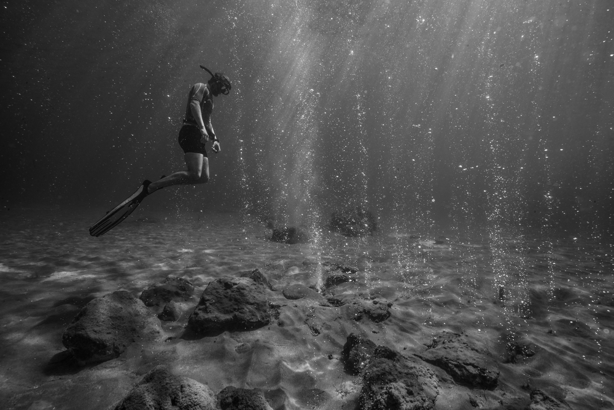

# Structure and metabolic potential of the prokaryotic communities from the hydrothermal system of Paleochori Bay, Milos, Greece.
Sven Le Moine Bauer, Guang-Sin Lu, Steven Goulaouic, Valentine Puzenat, Anders Schouw, Thibaut Barreyre, Vera Pawlowski-Glahn, Juan Jose Egozcue, Jean-Emmanuel Martelat, Javier Escartin, Jan P. Amend, Paraskevi Nomikou, Othonas Vlasopoulos, Paraskevi Polymenakou, Steffen Leth Jørgensen

The repository contains the integrality of the scripts needed to process the data presented in the aforementioned article.

In order, the following links will bring you to:
- [The processing of the sequences and picking of OTUs.](https://github.com/MeinzBeur/LeMoineBauer-2022-Milos/blob/main/Pipeline%20explanations.md)
- The decontamination protocol for all OTUs.
- Making of each figure: Figure 2, Figure 3, Figure 4, Figure 5. 

==THIS DEPOSITORY IS NOT COMPLETE==
