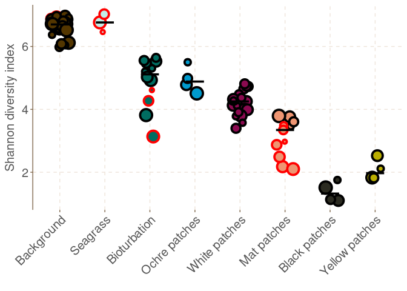

Shannon analysis
================
Sven Le Moine Bauer
2022-11-24

## Introduction

Here you will find the code to build figure 2C representing the shannon
diversity index. In principle it is very similar to the code for figure
2D. We use phyloseq to calculate the Shannon index. Let’s start by
loading the librairies.

``` r
library(phyloseq)
library(ggplot2)
library(ggthemr)

# Set directory
setwd(dirname(rstudioapi::getActiveDocumentContext()$path))
```

## Preparing the data

Let’s load the data.

``` r
OTUtable <- read.csv("otutab_decontam.csv", row.names=1, sep = "\t")
taxtable <- read.csv("tax_decontam.csv", row.names = 1, sep = ",")
Metatable <- read.csv("Metadata.csv", row.names = 1, sep = ",")
```

And make a phyloseq object.

``` r
#Transform into matrixes the OTU and tax tables (needed for phyloseq)
OTUtable <- as.matrix(OTUtable)
taxtable <- as.matrix(taxtable)

#Make phyloseq objects
OTU = otu_table(OTUtable, taxa_are_rows = TRUE)
TAX = tax_table(taxtable)
samples = sample_data(Metatable)
Milos <- phyloseq(OTU, TAX, samples)
```

Some samples are not needed in this analysis, so we will remove them.

``` r
to_remove <- c("TZF", "WMF", "C25_0", "C26_0", "blank", "MAT1", "MAT2", "SSW")
Milos <- prune_samples(!(sample_names(Milos) %in% to_remove), Milos)

# Make the palette
col <- c("#533600", "#C3EDE7", "#006D61", "deepskyblue3", "deeppink4", "lightsalmon2", "#2B2B21", "#BAAE00")
```

## Shannon index

The index is easily computed in phyloseq.

``` r
Shannon <- estimate_richness(Milos, split = TRUE, measures = "Shannon")
```

Now we will add the value to our metadata table.

``` r
# We removed some samples, so we should get the table from the phylsoeq object.
Metatable <- as.data.frame(sample_data(Milos)) 
# Add the Shannon index values
Metatable$Shannon <- Shannon$Shannon[match(row.names(Metatable), row.names(Shannon))]
# Factorise the order of seafloors.
Metatable$Seafloor_type<-factor(Metatable$Seafloor_type, c("Background", "Seagrass", "Bioturbation", "Ochre patches", "White patches", "Mat patches", "Black patches", "Yellow patches", "Mat", "Seawater")) # Factorise and organise the order of the seafloors
```

Finally, we can plot the result. The code is as for the qPCR data, but
we added the border colors matching the datasets.

``` r
ggthemr("fresh")
ggplot(Metatable, aes(x=Seafloor_type, y=Shannon)) + 
  geom_jitter(aes(size = Depth, fill = Seafloor_type, colour = Dataset), shape = 21, width = 0.2, stroke = 2) +
  stat_summary(fun=median, geom="crossbar", size=0.5, color="black", width = 0.4) +
  scale_colour_manual(values = c("black", "red")) +
  scale_fill_manual(values = col) +
  theme(
    legend.position="None",
    axis.text.x = element_text(size = 15, angle = 45, hjust = 1, vjust = 1),
    axis.text.y = element_text(size = 15),
    axis.title.y = element_text(size = 15),
    strip.text.x = element_blank(),
    panel.spacing.x = unit(1, "lines"),
    axis.line.x = element_blank()) +
  labs(x = element_blank(), y = "Shannon diversity index")
```

<!-- -->
