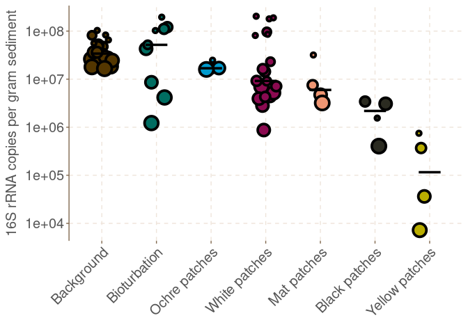
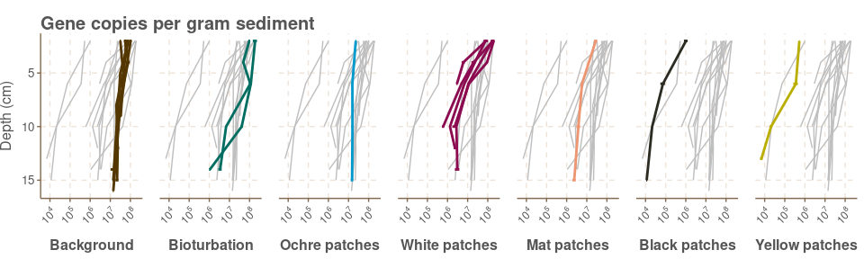

The qPCR analysis
================
Sven Le Moine Bauer
2022-11-24

## Introduction

Here we will go through the code needed to plot the qPCR-based absolute
abundance figures (2D and 3). The only one file needed is the Metadata
file.

## Loading and preparing the data.

Let’s start by loading the libraries and set up the working directory

``` r
library(dplyr)
library(ggplot2)
library(ggthemr)
library(ggpubr)
library(scales)
# Set directory
setwd(dirname(rstudioapi::getActiveDocumentContext()$path))
```

Now we can import the data. The file should be in the same directory as
the script. The file can be found on the Github.

``` r
# Import data, without the mats.
qPCRtable <- read.csv("Metadata.csv", row.names=1, sep = ",")
# remove the 0/NA depth samples, as well as the samples of the Saganaki dataset (no qPCR data).
qPCRtable<-subset(qPCRtable, Depth!="NA" & Depth!=0 & Dataset == "Cardhynal")
# Factorise the order of seafloor type.
qPCRtable$Seafloor_type <- factor(qPCRtable$Seafloor_type, levels = c("Background", "Bioturbation","Ochre patches", "White patches", "Mat patches", "Black patches", "Yellow patches"))
qPCRtable <- qPCRtable[order(qPCRtable$Seafloor_type, qPCRtable$Core, qPCRtable$Depth),]
# Make colour palette
colours_seafloor <- c("#533600", "#006D61", "deepskyblue3", "deeppink4", "lightsalmon2", "#2B2B21", "#BAAE00")
# Create a duplicate variable of seafloor to be able to deal with the facet-wrap in figure 3
qPCRtable <- qPCRtable %>% mutate(Seafloor_type2=Seafloor_type)
```

## The 16S total abundance per seafloor type plot (Figure 2D)

The total 16S is considered to be the sum of bacterial and archaeal 16S.
The plot uses geom_jitter grouped per seafloor types.

``` r
ggthemr("fresh")
ggplot(qPCRtable, aes(x=Seafloor_type, y=Uni_avg)) +
  geom_jitter(aes(size = Depth, fill = Seafloor_type, colour = Dataset), shape = 21, width = 0.2, stroke = 2) +
  stat_summary(fun=median, geom="crossbar", size=0.5, color="black", width = 0.4) +
  scale_colour_manual(values = "black") +
  scale_fill_manual(values = colours_seafloor) +
  scale_y_log10() +
  theme(
    legend.position="None",
    axis.text.x = element_text(size = 15, angle = 45, hjust = 1, vjust = 1),
    axis.text.y = element_text(size = 15),
    axis.title.y = element_text(size = 15),
    strip.text.x = element_blank(),
    panel.spacing.x = unit(1, "lines"),
    axis.line.x = element_blank()) +
  labs(x = element_blank(), y = "16S rRNA copies per gram sediment")
```

<!-- -->

## The plots of various gene abundances (Fig 3)

The code to make this spaghetti plot has been found
[here](https://www.data-to-viz.com/caveat/spaghetti.html). Here I show
only the code for the bacterial 16S gene, but it can be adapted to the
other genes just by changing the variable plotted.

``` r
ggthemr("fresh")
ggplot(qPCRtable, aes(x=X16SBac_avg, y=Depth, group=Core, color=Seafloor_type, xmin=X16SBac_avg-X16SBac_stdev, xmax=X16SBac_avg+X16SBac_stdev)) +
  geom_path(data=qPCRtable %>% dplyr::select(-Seafloor_type), aes(group=Core), color="grey", size=0.5, alpha=1) +
  geom_path(size=1) +
  geom_errorbarh(height = 0, size = 1) +
  scale_color_manual(values = colours_seafloor) +
  scale_y_reverse(breaks = c(15,10,5), limits = c(16,2)) +
  scale_x_log10(NULL,
                breaks = trans_breaks("log10", function(x) 10^x),
                labels = trans_format("log10", math_format(10^.x))) +
  theme(
    legend.position="none",
    plot.title = element_text(size=15, vjust = -1),
    axis.text.x = element_text(angle = 45, hjust = 1, size = 9),
    axis.text.y = element_text(size = 10),
    strip.text.x = element_text(size = 12, face = "bold"),
    strip.placement = "outside",
    panel.spacing.x = unit(1, "lines"),
    plot.margin=unit(c(0.2,0.2,0,0),"cm")) +
  labs(y = "Depth (cm)", x = "Copies per gram sediment") +
  ggtitle("Gene copies per gram sediment") +
  facet_wrap(~Seafloor_type, nrow = 1, switch = "x")
```

<!-- -->
